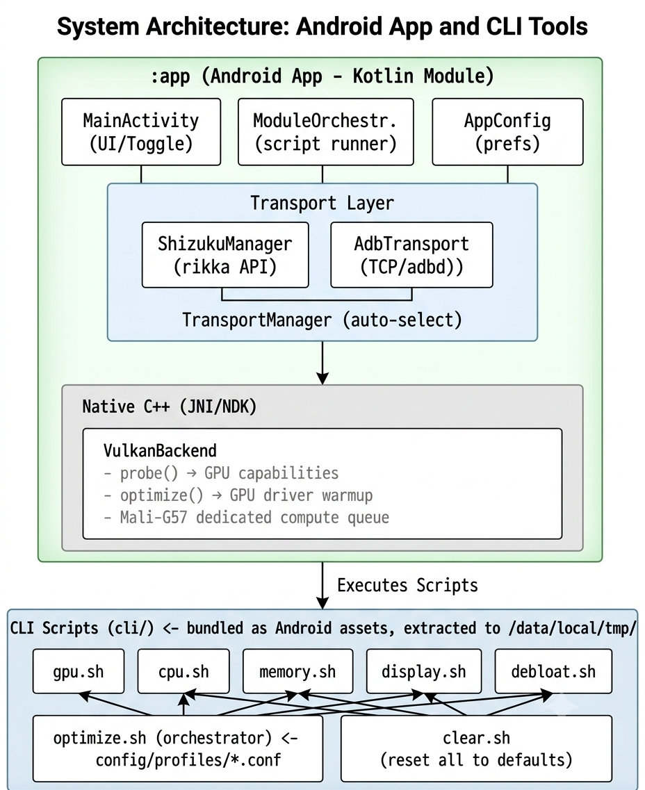

# OptHelioG99

On-device Android performance optimizer for **Infinix Note 40** (MediaTek Helio G99 Ultimate + ARM Mali-G57 MC2). No root required.

---

## Overview

OptHelioG99 pushes GPU-bound gaming performance via system property tuning, scheduler hints, memory optimization, display tweaks, XOS debloating, and native Vulkan backend initialization — all without root access. Changes are runtime-only (survive until reboot).

Two delivery forms target the same optimization logic:

| Form | Description |
|------|-------------|
| **Android App** | GUI dashboard with profile selection, Vulkan GPU info, live log. Uses Shizuku API for ADB-level privilege escalation. |
| **CLI Scripts** | Standalone shell scripts in `cli/`. Run via ADB from PC or on-device via Shizuku's shell. Single source of truth — the app executes these same scripts internally. |

---

## Architecture



### Transport: Shizuku vs ADB

The app needs ADB-level shell access to run `settings`, `setprop`, `cmd power`, and `pm` commands. Two transport backends implement the same `CommandTransport` interface:

| Transport | How it works | When used |
|-----------|-------------|-----------|
| **ShizukuManager** | Uses `rikka.shizuku` API — `Shizuku.newProcess()` spawns a shell with system (ADB) UID. | Primary. Requires Shizuku app installed + running. |
| **AdbTransport** | Implements ADB wire protocol over TCP — connects to `adbd` on localhost, handles RSA key auth. | Fallback if Shizuku unavailable. Requires ADB over Wi-Fi enabled. |

`TransportManager` auto-selects: tries Shizuku first, falls back to ADB if Shizuku disconnects or errors. The on-device boot-time auto-apply uses `ShizukuManager` directly (Shizuku is guaranteed available by the time the boot service starts).

---

## Target Device

| Spec | Value |
|------|-------|
| **Device** | Infinix Note 40 |
| **SoC** | MediaTek Helio G99 Ultimate |
| **CPU** | 2× Cortex-A76 @ 2.2 GHz + 6× Cortex-A55 @ 2.0 GHz |
| **GPU** | ARM Mali-G57 MC2 @ 1 GHz |
| **RAM** | 8 GB LPDDR4X |
| **OS** | Android 14 + XOS 14 |
| **Vulkan** | 1.3 (Mali driver), compute queue at family index 0 |

**Beta testing status:** Tested on Infinix Note 40 (XOS 14, Android 14, Helio G99). Other MediaTek Helio G99 devices (Redmi Note 12 4G, Realme 9i 5G, etc.) should work but are untested. Mali-G52/G76 devices may work with reduced gains.

---

## Warnings & Disclaimer

**Using this software may have side effects, including but not limited to:**

- **Performance profile** (`set-fixed-performance-mode-enabled true`) increases power consumption and heat. The device may throttle or shut down if cooling is insufficient.
- **Debloating** (`pm disable-user`) disables system packages. Some are safe to disable; others may cause crashes or boot loops. The `balanced` profile runs debloat in dry-run mode by default — nothing is disabled unless you edit the config or select the `performance` profile.
- **setprop changes** are mostly `debug.*` properties (runtime, reset on reboot). A few `persist.*` properties survive reboot.
- **120 Hz refresh lock** increases battery drain.
- **ZRAM disable** (performance profile) may cause out-of-memory kills under heavy multitasking.

**Disclaimer:** This software is provided "as is", without warranty of any kind. The author(s) are not responsible for any damage to your device, including but not limited to data loss, hardware failure, or voided warranty. Use at your own risk. If your device overheats, reboot it — all runtime optimizations will reset.

---

## Getting Started

### Android App

1. Install [Shizuku](https://shizuku.rikka.app/) from Play Store
2. Start Shizuku and grant adb/root permission per its instructions
3. Download the latest APK from [Releases](https://github.com/antinormies/OptHelioG99/releases)
4. Install and open OptHelioG99
5. Select a profile (Balanced or Gaming) and tap **Apply**
6. Toggle **Vulkan native warmup** on/off (initializes GPU driver via C++ backend)
7. Toggle **Auto-apply on boot** if you want the profile re-applied after reboot

### CLI via ADB (PC)

```bash
# Linux / macOS
git clone https://github.com/antinormies/OptHelioG99.git
cd OptHelioG99

# Apply balanced profile
ADB=adb sh cli/optimize.sh balanced

# Apply gaming profile
ADB=adb sh cli/optimize.sh performance

# Dry-run (preview changes only)
ADB=adb sh cli/optimize.sh balanced --dry-run

# Clear all optimizations
ADB=adb sh cli/clear.sh
```

```powershell
# Windows PowerShell
$env:ADB="adb"
sh cli/optimize.sh balanced

# Or with full ADB path
$env:ADB="C:\Users\you\AppData\Local\Android\Sdk\platform-tools\adb.exe"
sh cli/optimize.sh balanced
```

### CLI via Shizuku Shell (on-device)

The app bundles these scripts and executes them via Shizuku. To run manually on-device after extraction:

```bash
# From a terminal emulator or Shizuku shell
ADB="" sh /data/local/tmp/opt_heliog99/scripts/optimize.sh balanced
```

---

## Project Layout

```
cli/              ← Single source of truth for optimization logic
  optimize.sh       Orchestrator — runs all 5 modules per profile
  clear.sh          Reset all optimizations to defaults
  modules/
    gpu.sh          GPU composition, UBWC, EGL, MSAA, HWUI tuning
    cpu.sh          Scheduler hints, fixed perf mode, uclamp, power HAL
    memory.sh       ZRAM, LMK minfree, I/O prefetcher, fstrim
    display.sh      Refresh rate, animations, overlays, VSync, doze
    debloat.sh      XOS bloatware (Transsion packages) management
  config/profiles/
    balanced.conf   120 Hz, 4 render threads, GPU comp, dry-run debloat
    performance.conf 120 Hz, 8 render threads, fixed perf mode, full debloat

app/              ← Android application
  src/main/java/.../
    MainActivity.kt   UI with profile selector, Vulkan dashboard, log
    shizuku/          Transport layer (ShizukuManager, AdbTransport, TransportManager)
    modules/          ModuleOrchestrator — extracts scripts from assets, executes via transport
    native/           VulkanBridge + VulkanDeviceInfo (JNI bridge)
    config/AppConfig.kt  SharedPreferences persistence
    receiver/BootReceiver.kt  Boot completed → OptimizerService
    service/OptimizerService.kt  Foreground service for auto-apply
  src/main/cpp/     Native C++ (NDK/CMake)
    vulkan_backend.h/.cpp  Vulkan instance, device selection, compute queue, probe/optimize
    vulkan_bridge.cpp       JNI glue (nativeProbeDevice, nativeOptimize)
    gpu_tuner.h/.cpp        GPU property tuning via JNI callbacks (deprecated, now done by scripts)

docs/             ← Design docs and research
  PLAN.md           Full project plan and architecture
  research/         Helio G99 notes, Mali-G57 notes, XOS bloat list
  resources/        Reference materials (gitignored)

test/             ← Benchmark results directory
  benchmark-results/  Before/after performance data
```

---

## License

This project is open source and available for anyone to use, modify, and distribute. See the [LICENSE](LICENSE) file for details (MIT license).

---

## Building from Source

```bash
git clone https://github.com/antinormies/OptHelioG99.git
cd OptHelioG99
./gradlew assembleDebug
```

Requires Android Studio, NDK, and CMake. The CLI scripts in `cli/` are bundled as Android assets during build.
