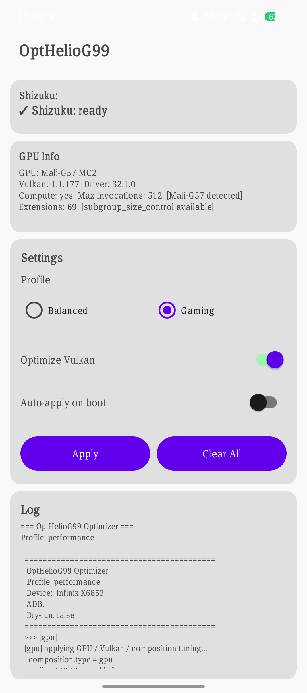
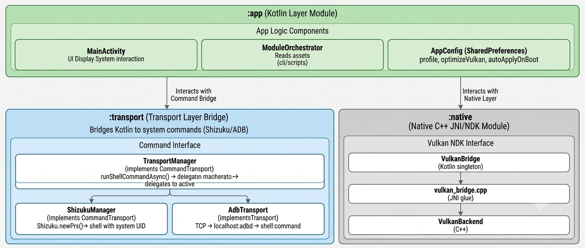

# OptHelioG99 — Android App

On-device GUI for the OptHelioG99 optimizer. Uses Shizuku API for privilege escalation and executes the CLI shell scripts as the single source of truth for all optimization logic.

---

## Overview

The Android app provides a simple dashboard to select optimization profiles, view GPU/Vulkan capabilities, toggle native GPU warmup, and stream live log output. All optimization logic lives in `cli/` shell scripts — the app never duplicates tuning commands in Kotlin.

<div align="center">
   
</div>


### What the app does

1. Binds to **Shizuku** (or falls back to ADB-over-TCP) for system-level shell access
2. Probes **Vulkan capabilities** via native C++ (GPU name, driver version, extensions, compute queue)
3. Extracts bundled CLI scripts to `/data/local/tmp/opt_heliog99/scripts/`
4. Runs `optimize.sh <profile>` or `clear.sh` via the active transport
5. Optionally runs **Vulkan GPU warmup** (native C++ optimization) after shell scripts complete
6. Can auto-apply on boot via `BootReceiver` + `OptimizerService`

---

## Shizuku-API & CLI Module Integration

### Transport Layer

The app abstracts privilege escalation through a `CommandTransport` interface:

```
CommandTransport (interface)
├── ShizukuManager  ← rikka.shizuku API (primary, on-device)
└── AdbTransport    ← ADB wire protocol over TCP (fallback, PC ADB)

TransportManager    ← auto-selects Shizuku → ADB
```

**ShizukuManager** uses `Shizuku.newProcess()` to spawn a shell with system UID — same level as `adb shell`. This is the primary transport on-device.

**AdbTransport** implements the ADB protocol directly (CNXN, AUTH, OPEN, OKAY, WRTE, CLSE packets) over a TCP socket to localhost. It discovers the ADB port via system properties, generates RSA 2048-bit keys, and authenticates with `adbd`. This is a fallback for when Shizuku is not available (requires ADB over Wi-Fi enabled).

### CLI Script Execution

The `ModuleOrchestrator` class:
1. Lists all files in `cli/` (bundled as Android assets via `assets.srcDirs`)
2. Extracts each file to `/data/local/tmp/opt_heliog99/scripts/` by base64-encoding the content and decoding it on-device via Shizuku shell commands (avoids SELinux restrictions on `/data/data/` paths)
3. Runs `ADB="" sh optimize.sh <profile> 2>&1` as a single Shizuku shell command

The extracted scripts live in a world-accessible location (`/data/local/tmp/`) so the shell UID can read and execute them.

---

## Architecture



### CLI Implementation

The app never hardcodes optimization commands in Kotlin. Instead:

1. **Build time**: `cli/` directory is configured as an additional asset source in `app/build.gradle.kts`:
   ```kotlin
   assets.srcDirs("src/main/assets", rootProject.projectDir.resolve("cli").path)
   ```
2. **Runtime**: `ModuleOrchestrator` discovers all asset files recursively (`optimize.sh`, `clear.sh`, `modules/*.sh`, `config/profiles/*.conf`), extracts them to `/data/local/tmp/opt_heliog99/scripts/`, then runs the orchestrator script as a single shell command
3. **Output**: Script stdout/stderr streams back to the app via `CommandTransport.runShellCommandAsync()` callbacks and displays in the log TextView

This design means:
- **No duplication** — the CLI and the app use identical scripts
- **No divergence** — changes to `cli/` automatically affect the app on next build
- **Testable CLI** — you can run the scripts independently via ADB from a PC for testing or headless use

### Vulkan Comprehensive Detail

The native Vulkan backend is the core differentiator from simple shell-script optimizers.

#### probe()

Called on app startup. Performs:
1. `vkCreateInstance` (Vulkan 1.0 baseline)
2. `vkEnumeratePhysicalDevices` — selects ARM Mali GPU (vendor ID `0x13B5`)
3. `vkGetPhysicalDeviceProperties` — reads device name, Vulkan/driver version, hardware limits
4. `vkGetPhysicalDeviceQueueFamilyProperties` — identifies compute-capable queue family
5. `vkCreateDevice` with compute queue — tests that a logical device can be created
6. `vkEnumerateDeviceExtensionProperties` — lists all available extensions
7. Returns `VulkanDeviceInfo` data class to Kotlin for UI display

#### optimize(performance)

Called after shell scripts complete, when the Vulkan toggle is ON. Performs a full GPU driver initialization sequence:

1. `vkCreateInstance` → creates Vulkan instance
2. `vkEnumeratePhysicalDevices` → selects Mali GPU
3. `vkCreateDevice` with dedicated compute queue → creates logical device
4. `vkGetDeviceQueue` → acquires compute queue handle
5. `vkCreateCommandPool` → allocates command pool
6. `vkAllocateCommandBuffers` → allocates command buffer
7. `vkBeginCommandBuffer` / `vkEndCommandBuffer` → records empty command buffer
8. `vkCreateFence` → creates synchronization fence
9. `vkQueueSubmit` → submits to GPU compute queue
10. `vkWaitForFences` → waits for GPU completion (forces full driver init)
11. `vkDestroyFence` / `vkFreeCommandBuffers` / `vkDestroyCommandPool` / `vkDestroyDevice` / `vkDestroyInstance` → cleanup

This forces the GPU driver to fully initialize its internal state, allocate memory pools, set up pipeline caches, and establish the Vulkan runtime — reducing jank and stutter when games first call into Vulkan. In `performance` mode, the driver is primed for max throughput; in balanced mode, for standard operation.

The entire sequence is logged back to the app UI.

---

## Getting Started

1. **Install Shizuku** from [Google Play](https://play.google.com/store/apps/details?id=moe.shizuku.privileged.api) or [GitHub](https://github.com/RikkaApps/Shizuku/releases)
2. **Start Shizuku** and grant permission per the app's instructions (ADB or root)
3. **Build or download** the OptHelioG99 APK:
   ```bash
   git clone https://github.com/antinormies/OptHelioG99.git
   cd OptHelioG99
   ./gradlew assembleDebug
   ```
4. **Install** `app/build/outputs/apk/debug/app-debug.apk`
5. **Open the app** — Shizuku status shows at the top. Tap "Open Shizuku" if not running
6. **Select a profile** (Balanced or Gaming)
7. **Toggle Vulkan warmup** (recommended: ON)
8. **Tap Apply** — log output streams live
9. **Enable auto-apply** if you want the profile restored after reboot

### Profiles

| Profile | Display | GPU Threads | CPU Target | Debloat | Best For |
|---------|---------|-------------|------------|---------|----------|
| Balanced | 120 Hz peak, 60 Hz min | 4 render, 4 Skia | 72% CPU, 40% GPU | Dry-run (safe) | Daily use |
| Gaming | 120 Hz locked | 8 render, 8 Skia | 200% both | Full disable | Honor of Kings, Genshin Impact, PUBG |

### Permissions

- `moe.shizuku.manager.permission.API_V23` — Shizuku API access
- `RECEIVE_BOOT_COMPLETED` — auto-apply after reboot
- `FOREGROUND_SERVICE` + `POST_NOTIFICATIONS` — boot-time notification
